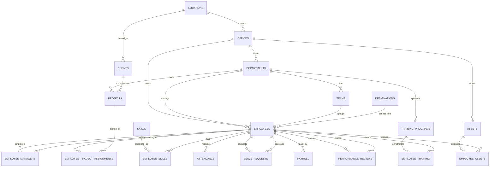

# Employee Management System ER Diagram

```mermaid
erDiagram
    LOCATIONS ||--o{ OFFICES : contains
    OFFICES ||--o{ DEPARTMENTS : hosts
    OFFICES ||--o{ EMPLOYEES : seats
    OFFICES ||--o{ ASSETS : stores
    DEPARTMENTS ||--o{ TEAMS : has
    DEPARTMENTS ||--o{ EMPLOYEES : employs
    DEPARTMENTS ||--o{ PROJECTS : owns
    DEPARTMENTS ||--o{ TRAINING_PROGRAMS : sponsors
    TEAMS ||--o{ EMPLOYEES : groups
    DESIGNATIONS ||--o{ EMPLOYEES : defines_role
    EMPLOYEES ||--o{ EMPLOYEE_MANAGERS : employee
    EMPLOYEES ||--o{ EMPLOYEE_MANAGERS : manager
    LOCATIONS ||--o{ CLIENTS : based_in
    CLIENTS ||--o{ PROJECTS : commissions
    EMPLOYEES ||--o{ EMPLOYEE_PROJECT_ASSIGNMENTS : works_on
    PROJECTS ||--o{ EMPLOYEE_PROJECT_ASSIGNMENTS : staffed_by
    SKILLS ||--o{ EMPLOYEE_SKILLS : classified_as
    EMPLOYEES ||--o{ EMPLOYEE_SKILLS : has
    EMPLOYEES ||--o{ ATTENDANCE : records
    EMPLOYEES ||--o{ LEAVE_REQUESTS : requests
    EMPLOYEES ||--o{ LEAVE_REQUESTS : approves
    EMPLOYEES ||--o{ PAYROLL : paid_by
    EMPLOYEES ||--o{ PERFORMANCE_REVIEWS : reviewed
    EMPLOYEES ||--o{ PERFORMANCE_REVIEWS : reviewer
    TRAINING_PROGRAMS ||--o{ EMPLOYEE_TRAINING : enrollments
    EMPLOYEES ||--o{ EMPLOYEE_TRAINING : attends
    ASSETS ||--o{ EMPLOYEE_ASSETS : assigned
    EMPLOYEES ||--o{ EMPLOYEE_ASSETS : receives
```
