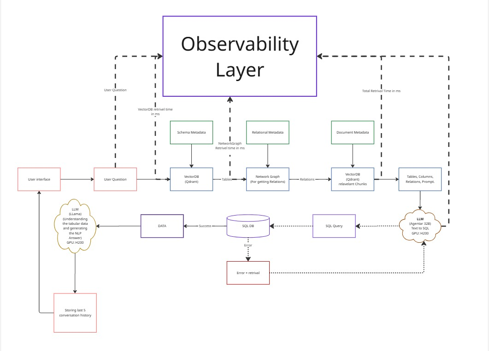

# Enterprise GraphRAG + Text-to-SQL Platform

An enterprise-grade AI platform that combines GraphRAG, Text-to-SQL, Self-Healing SQL, Explainability, and Observability to enable natural language interaction with relational databases.

The platform converts user questions into optimized SQL queries using Large Language Models, retrieves schema and relationship context through GraphRAG, automatically repairs failed queries, explains reasoning, and provides real-time observability for production monitoring.

---

## Key Features

### GraphRAG Architecture
- Schema-aware retrieval using Qdrant
- Relationship discovery using NetworkX
- Context enrichment using graph traversal
- Metadata-driven retrieval

### Text-to-SQL Engine
- Natural language to SQL conversion
- Database schema understanding
- Context-aware query generation
- Support for complex analytical queries

### Self-Healing SQL
- Automatic SQL error detection
- Error-aware query correction
- Retry and repair workflow
- Improved query success rate

### Explainability Layer
- Retrieved schema visibility
- Relationship tracing
- Generated SQL transparency
- End-to-end reasoning visibility

### Observability Dashboard
- Request monitoring
- Latency tracking
- SQL generation metrics
- Retrieval metrics
- Self-healing analytics
- Query execution analytics

### Enterprise Design
- Modular architecture
- Production-oriented design
- Scalable retrieval pipeline
- Monitoring and debugging support

---

# Architecture

---

# Employee Graph Design

